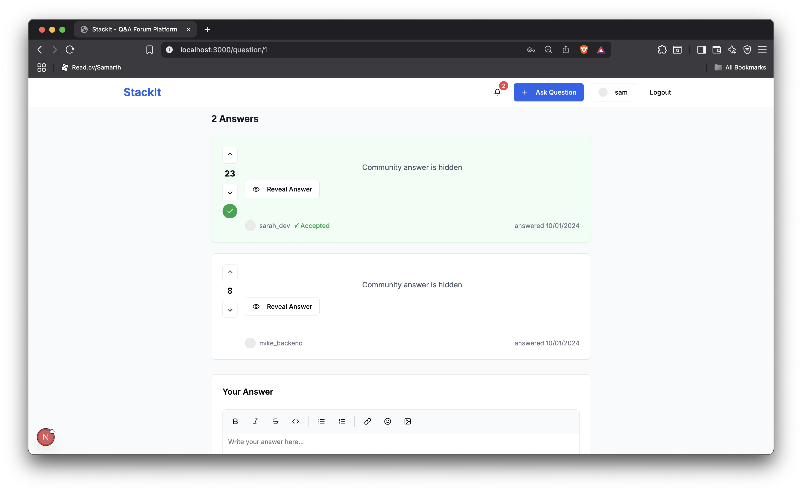

# 📋 StackIt – A Minimal Q&A Forum Platform

> A modern, minimal, and classy web application with an interactive design and responsive layout.

## 🧩 Problem Statement

- StackIt is a m inim al question-and-answer platform that supports collaborative
learning and structured knowledge sharing. It’s designed to be sim ple, user-friendly,
and focused on the core experience of asking and answering questions within a
com m unity.

## 👨‍💻 Contributors

| Name                | Role                            |
|---------------------|----------------------------------|
| [Samarth Dadhaniya](mailto:samarthdadhaniya7@gmail.com) | Backend Integration, Supabase |
| [Dhwani Navadia](mailto:dhwaninavadia29@gmail.com)     | Team Lead, Frontend Development |
| [Sanskruti Kukadiya](mailto:sanskrutikukadiya6@gmail.com) | UI/UX Design, Testing |
| [Urvi Patel](mailto:urvipatel275@gmail.com)             | Authentication, API Handling |

## 📽️ Project Demo Video Link

- https://drive.google.com/file/d/1aCK4_Bk4a64h_luorqSa3I2nbQitqRz9/view?usp=sharing

## 🛠️ Tech Stack

- **Frontend:** React.js  
- **Backend:** Supabase, Node.js, Express.js  
- **Authentication:** JWT Token  
- **UI Library:** ShadCN, Tailwind CSS 

## 🖼️ Images 

## 🚀 Features (Optional - Add if you want)

- 🔒 Secure login/signup with JWT authentication  
- ✍️ Rich text editor for formatting answers  
- 👁️ Hide/reveal mode for community answers  
- 👍 Upvote/👎 Downvote system  
- ⚡ Responsive and minimal modern UI  
- and more...

## 📬 Feedback

If you have any suggestions or want to contribute, feel free to fork the repo and submit a pull request. For major changes, please open an issue first.
